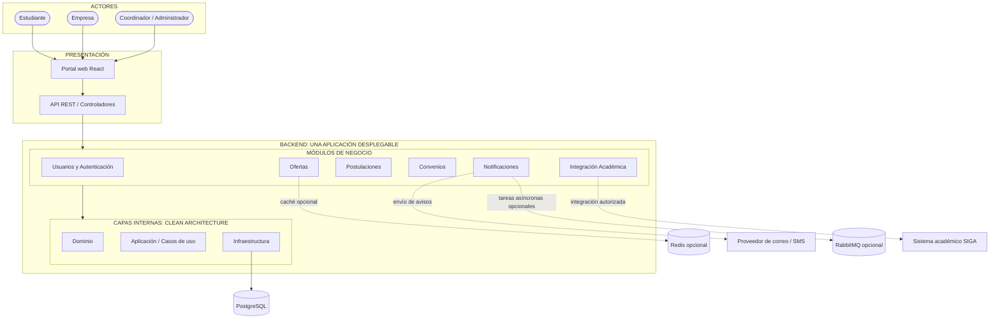

# Arquitectura Inicial del Sistema

## Estilo arquitectónico

El sistema se propone como un **monolito modular**: el backend se construye y despliega como una sola aplicación, pero su código se divide en módulos de negocio con responsabilidades e interfaces claras. La organización interna sigue el enfoque de Clean Architecture.

## Diagrama de arquitectura

El siguiente diagrama representa la arquitectura propuesta para el **Sistema Web para la Gestión y Publicación de Prácticas Preprofesionales (UNSCH)**.

## Responsabilidades principales

| Módulo | Responsabilidad |
|---|---|
| Usuarios y Autenticación | Identidad, acceso y permisos por rol. |
| Ofertas | Registro, publicación, edición, cierre y búsqueda de ofertas. |
| Postulaciones | Registro, validación, prevención de duplicados y seguimiento. |
| Convenios | Seguimiento de convenios de prácticas. |
| Notificaciones | Avisos sobre ofertas y cambios de estado. |
| Integración Académica | Consultar requisitos académicos a través de un adaptador, si se habilita el acceso a SIGA. |

## Consideraciones de diseño

- Los módulos forman parte de la misma aplicación y no son microservicios desplegados por separado.
- La base de datos PostgreSQL es la persistencia principal propuesta para la primera versión.
- Las reglas de negocio deben estar en el dominio y los casos de uso, no dentro de los controladores HTTP.
- Redis y RabbitMQ son opcionales; se incorporarán solo si los requisitos y las mediciones justifican su coste.
- La integración real con SIGA depende de los mecanismos de acceso que autorice la universidad.
- El diagrama es una propuesta conceptual. Debe actualizarse cuando se confirme la estructura real del código y la tecnología del backend.