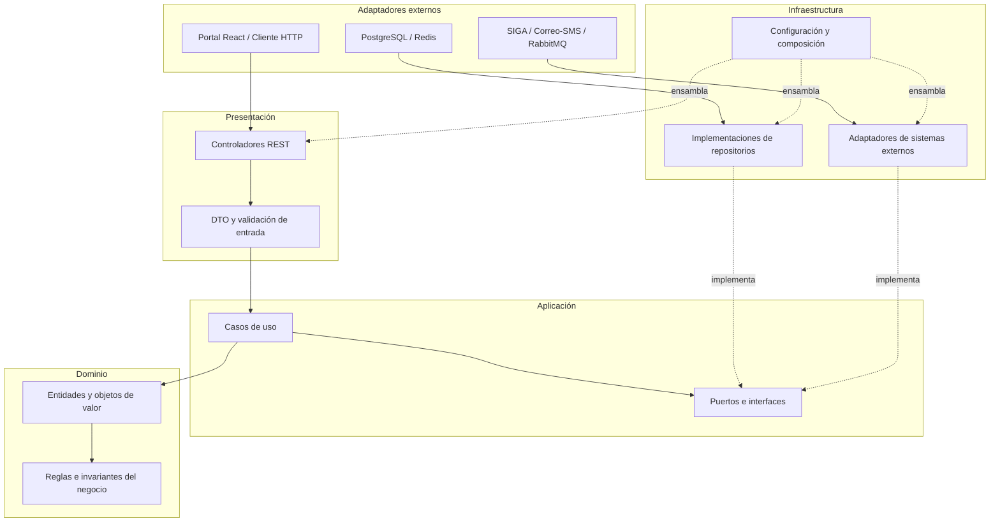

# Enfoque arquitectónico: Clean Architecture

## 1. Propósito

Definir cómo se organizan las responsabilidades y dependencias internas de los servicios del **Sistema Web para la Gestión y Publicación de Prácticas Preprofesionales de la UNSCH**. Este enfoque complementa el estilo global de microservicios descrito en `arquitectura/estilo-arquitectonico.md`; no lo reemplaza.

## 2. Enfoque seleccionado

**Clean Architecture (Arquitectura Limpia)**, con las dependencias del código dirigidas hacia el núcleo del negocio. Las reglas de dominio y los casos de uso no deben depender de React, del framework del backend, de PostgreSQL, Redis, RabbitMQ ni de la API externa de SIGA.

## 3. Capas y responsabilidades

| Capa | Responsabilidad | Ejemplos aplicados al sistema |
|---|---|---|
| **Dominio** | Entidades, objetos de valor, invariantes y reglas esenciales del negocio. No depende de frameworks ni de infraestructura. | Oferta, Postulación, Convenio; reglas como impedir postulaciones duplicadas y validar transiciones de estado. |
| **Aplicación** | Casos de uso, coordinación del flujo y puertos/interfaces requeridos por el negocio. | PublicarOferta, BuscarOfertas, RegistrarPostulación, ConsultarEstadoPostulación, ActualizarEstadoConvenio y GenerarNotificación. |
| **Presentación** | Adaptadores de entrada: controladores HTTP, validación de solicitudes y respuestas DTO. En el cliente, la interfaz React consume la API. | Endpoints REST para ofertas, postulaciones y convenios; formularios y vistas del portal web. |
| **Infraestructura** | Implementaciones técnicas de los puertos: persistencia, mensajería, servicios externos y configuración del framework. | Repositorios PostgreSQL, adaptador de SIGA, cliente de correo/SMS, adaptador Redis o publicación en RabbitMQ. |

Los nombres anteriores son una organización propuesta. Deben ajustarse a los nombres reales de carpetas, clases y servicios cuando se implemente cada módulo.

## 4. Regla de dependencias

1. El dominio no importa clases de las demás capas.
2. Aplicación puede utilizar el dominio y define interfaces para las capacidades externas que necesita.
3. Presentación invoca casos de uso; no implementa reglas centrales del negocio.
4. Infraestructura implementa las interfaces definidas por el núcleo y puede depender de librerías técnicas.
5. El ensamblaje de dependencias se realiza en el punto de composición de la aplicación, sin introducir referencias de infraestructura dentro del dominio.

Por ejemplo, el caso de uso `RegistrarPostulacion` debería utilizar una interfaz `PostulacionRepository`. La implementación concreta que persiste en PostgreSQL se ubica en infraestructura. Así se puede probar la regla de evitar duplicados usando un repositorio simulado, sin levantar una base de datos real.

## 5. Diagrama de Clean Architecture

El diagrama es conceptual. Las flechas de flujo muestran la interacción, mientras que las relaciones punteadas indican que los adaptadores concretos implementan puertos del núcleo o que la configuración conecta las implementaciones. La regla esencial es que el código del dominio y de aplicación no importe infraestructura.

## 6. Ejemplo de aplicación: registrar una postulación

1. El estudiante envía la solicitud desde el portal web.
2. El controlador REST valida el formato de entrada y llama al caso de uso.
3. El caso de uso comprueba las reglas del dominio y consulta los puertos necesarios.
4. Los adaptadores de infraestructura consultan la elegibilidad académica a través del puerto de integración y persisten la postulación mediante el repositorio.
5. El caso de uso devuelve un resultado que el adaptador de presentación transforma en una respuesta HTTP.

Las comprobaciones críticas —por ejemplo, no postular dos veces a la misma oferta— deben protegerse también en la persistencia mediante una restricción adecuada o una operación transaccional, para evitar duplicados ante solicitudes concurrentes.

## 7. Beneficios para DA06 — Mantenibilidad

- **Cambios localizados:** modificar el proveedor de correo o el acceso a datos no obliga a reescribir las reglas de postulación.
- **Pruebas unitarias:** los casos de uso se prueban con dobles de prueba para repositorios y servicios externos.
- **Menor acoplamiento:** la lógica del negocio no conoce detalles de HTTP, SQL ni SDK externos.
- **Evolución controlada:** cada cambio puede asociarse con un requisito, un caso de uso y una prueba.
- **Revisión más sencilla:** los límites entre capas permiten detectar dependencias indebidas durante las revisiones de código.

## 8. Criterios de verificación

- El dominio no importa frameworks, controladores, ORM ni clientes externos.
- Los casos de uso se pueden probar sin conexión real a PostgreSQL, SIGA o servicios de mensajería.
- Los contratos de repositorios e integraciones están definidos en el núcleo y sus implementaciones en infraestructura.
- Los controladores no contienen reglas de negocio centrales.
- Las pruebas cubren reglas de elegibilidad, duplicidad de postulaciones y transiciones de estado.

## 9. Alcance de esta propuesta

Este documento define una guía de organización arquitectónica, no afirma que las capas ya estén implementadas en el código. La aplicación efectiva debe realizarse gradualmente y contrastarse con la estructura real de cada servicio.
