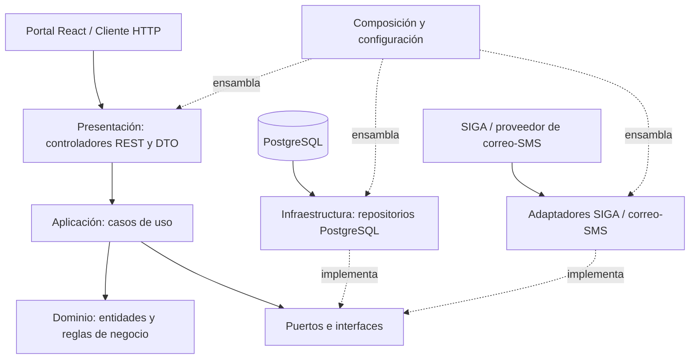

# Enfoque arquitectónico: Clean Architecture

## 1. Propósito

Definir cómo se organizan las responsabilidades y dependencias internas del **monolito modular** del Sistema Web para la Gestión y Publicación de Prácticas Preprofesionales de la UNSCH. Este enfoque complementa el estilo global descrito en `arquitectura/estilo-arquitectonico.md`: una sola aplicación desplegable organizada en módulos de negocio.

## 2. Enfoque seleccionado

**Clean Architecture (Arquitectura Limpia)**, con las dependencias del código dirigidas hacia el núcleo del negocio. Las reglas de dominio y los casos de uso no deben depender de React, del framework del backend, de PostgreSQL, Redis, RabbitMQ ni de la API externa de SIGA.

## 3. Módulos de negocio

La aplicación se organizará inicialmente en módulos lógicos como:

- **Usuarios y Autenticación:** identidad, acceso y roles.
- **Ofertas:** publicación, edición, cierre y búsqueda de oportunidades.
- **Postulaciones:** registro, validación de requisitos, prevención de duplicados y seguimiento.
- **Convenios:** seguimiento del ciclo de vida de los convenios.
- **Notificaciones:** preparación y envío de avisos.
- **Integración Académica:** acceso a los datos de elegibilidad mediante un adaptador autorizado.

Estos módulos forman parte del mismo backend desplegable. Cada uno debe exponer una interfaz interna clara y evitar acceder directamente a las clases o tablas internas de los demás módulos. Los nombres se ajustarán a la implementación real.

## 4. Capas y responsabilidades

| Capa | Responsabilidad | Ejemplos aplicados al sistema |
|---|---|---|
| **Dominio** | Entidades, objetos de valor, invariantes y reglas esenciales del negocio. | Oferta, Postulación, Convenio; impedir postulaciones duplicadas y validar transiciones de estado. |
| **Aplicación** | Casos de uso, coordinación del flujo y puertos/interfaces requeridos por el negocio. | PublicarOferta, BuscarOfertas, RegistrarPostulacion, ConsultarEstadoPostulacion, ActualizarEstadoConvenio y GenerarNotificacion. |
| **Presentación** | Adaptadores de entrada: controladores HTTP, validación de solicitudes y respuestas DTO. El cliente React consume la API. | Endpoints REST para ofertas, postulaciones y convenios; formularios y vistas del portal web. |
| **Infraestructura** | Implementaciones técnicas de los puertos: persistencia, integración externa, mensajería y configuración del framework. | Repositorios PostgreSQL, adaptador de SIGA, cliente de correo/SMS y, si se justifica, adaptadores Redis o RabbitMQ. |

## 5. Regla de dependencias

1. El dominio no importa clases de las demás capas.
2. Aplicación utiliza el dominio y define interfaces para las capacidades externas que necesita.
3. Presentación invoca casos de uso; no implementa reglas centrales del negocio.
4. Infraestructura implementa las interfaces definidas por el núcleo y puede depender de librerías técnicas.
5. Los módulos interactúan mediante interfaces o servicios de aplicación explícitos, no mediante acceso indiscriminado a sus clases internas.
6. El ensamblaje de dependencias se realiza en el punto de composición de la aplicación.

Por ejemplo, el caso de uso `RegistrarPostulacion` debería utilizar una interfaz `PostulacionRepository`. La implementación concreta que persiste en PostgreSQL se ubica en infraestructura. Así se puede probar la regla de evitar duplicados usando un repositorio simulado, sin levantar una base de datos real.

## 6. Diagrama de Clean Architecture

El diagrama es conceptual y muestra las capas internas de la aplicación. La regla esencial es que el dominio y los casos de uso no importen infraestructura.

## 7. Ejemplo: registrar una postulación

1. El estudiante envía la solicitud desde el portal web.
2. El controlador REST valida el formato de entrada y llama al caso de uso.
3. El caso de uso verifica las reglas del dominio y consulta los puertos necesarios.
4. El adaptador de integración consulta la elegibilidad académica si existe acceso autorizado a SIGA.
5. El repositorio persiste la postulación en PostgreSQL.
6. El controlador transforma el resultado en una respuesta HTTP.

Las comprobaciones críticas —por ejemplo, no postular dos veces a la misma oferta— deben protegerse también en la persistencia mediante una restricción adecuada o una operación transaccional, para evitar duplicados ante solicitudes concurrentes.

## 8. Beneficios para DA06 — Mantenibilidad

- **Cambios localizados:** modificar el proveedor de correo o el acceso a datos no obliga a reescribir las reglas de postulación.
- **Pruebas unitarias:** los casos de uso se prueban con dobles de prueba para repositorios y servicios externos.
- **Menor acoplamiento:** la lógica del negocio no conoce detalles de HTTP, SQL ni SDK externos.
- **Evolución controlada:** cada cambio puede asociarse con un requisito, un caso de uso y una prueba.
- **Revisión más sencilla:** los límites entre capas y módulos permiten detectar dependencias indebidas.

## 9. Criterios de verificación

- El dominio no importa frameworks, controladores, ORM ni clientes externos.
- Los casos de uso se pueden probar sin conexión real a PostgreSQL, SIGA o servicios de mensajería.
- Los contratos de repositorios e integraciones están definidos en el núcleo y sus implementaciones en infraestructura.
- Los controladores no contienen reglas de negocio centrales.
- Las pruebas cubren elegibilidad, duplicidad de postulaciones y transiciones de estado.
- Los módulos no acceden directamente a detalles internos de otros módulos.

## 10. Alcance de esta propuesta

Este documento define una guía de organización arquitectónica, no afirma que las capas ya estén implementadas en el código. La aplicación efectiva debe realizarse gradualmente y contrastarse con la estructura real del backend.