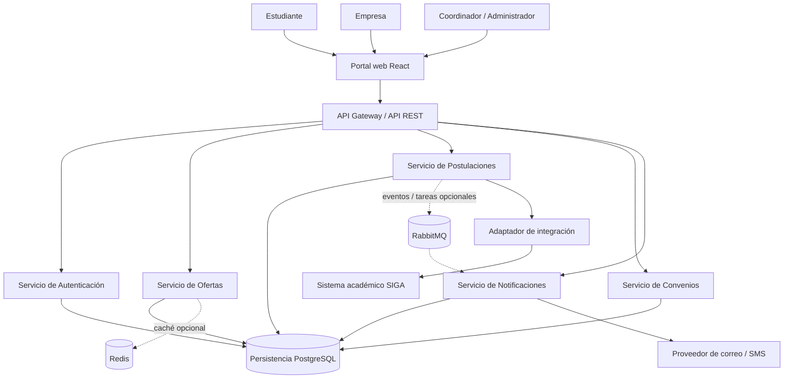

# Estilo arquitectónico

## 1. Propósito

Definir la organización global propuesta para el **Sistema Web para la Gestión y Publicación de Prácticas Preprofesionales de la UNSCH**, tomando como base los requisitos, atributos de calidad y drivers documentados en `analisis-de-sistema/`.

## 2. Estilo seleccionado

**Arquitectura de microservicios con comunicación mediante API REST y un API Gateway de entrada.**

El diseño conceptual separa las capacidades del negocio en servicios de Autenticación, Ofertas, Postulaciones, Convenios y Notificaciones. El portal web, propuesto con React, consume la API a través del Gateway. PostgreSQL se plantea como persistencia principal; Redis y RabbitMQ son componentes opcionales que se incorporarán si las pruebas de carga y los casos de uso justifican su coste operativo.

Esta es una **propuesta arquitectónica** del repositorio, no una afirmación de que todos esos servicios o tecnologías ya estén implementados.

## 3. Drivers que motivan la decisión

- **DA01 — Centralización de procesos dispersos:** una interfaz web única y un punto de entrada consistente para las solicitudes.
- **DA02 — Picos de demanda estacionales:** permitir optimizar las rutas de consulta y procesar tareas no inmediatas, como notificaciones.
- **DA03 — Integración con sistemas legados:** aislar la comunicación con SIGA mediante un adaptador, evitando propagar detalles de la API externa por el dominio.
- **DA04 — Evolución modular:** separar capacidades del negocio con contratos definidos.
- **DA06 — Mantenibilidad:** controlar dependencias y reducir el impacto de los cambios.

## 4. Componentes y responsabilidades

| Componente | Responsabilidad |
|---|---|
| Portal web (React) | Presentar los flujos de estudiantes, empresas, coordinadores y administradores. |
| API Gateway | Enrutar solicitudes hacia el servicio correspondiente y aplicar controles transversales de entrada. Cada servicio debe verificar también la autorización que corresponda a sus operaciones. |
| Servicio de Autenticación | Gestionar identidad, sesión o tokens y roles, según la implementación elegida. |
| Servicio de Ofertas | Gestionar publicación, edición, cierre, búsqueda y filtrado de ofertas. |
| Servicio de Postulaciones | Registrar postulaciones, evitar duplicados y controlar estados. |
| Servicio de Convenios | Dar seguimiento al ciclo de vida de convenios de prácticas. |
| Servicio de Notificaciones | Gestionar avisos por cambios de estado y nuevas ofertas. |
| PostgreSQL | Persistir información estructurada del sistema. En un diseño de microservicios, la propiedad de los datos y las reglas de acceso deben definirse por servicio. |
| Redis (opcional) | Almacenar temporalmente datos de lectura frecuente cuando la medición de rendimiento lo justifique. |
| RabbitMQ (opcional) | Desacoplar tareas asíncronas, por ejemplo, el envío de notificaciones. |
| Adaptador de SIGA | Traducir el contrato externo a un contrato interno y aislar cambios del sistema académico. |
| Servicio de correo/SMS | Entregar notificaciones a través de un proveedor externo. |

## 5. Diagrama global

El diagrama es lógico: la persistencia compartida se muestra para simplificar la vista general. Antes de implementar microservicios, se debe definir si cada servicio tendrá su propia base de datos o un esquema de propiedad de datos que evite dependencias directas entre servicios. No se recomienda que un servicio consulte directamente las tablas internas de otro.

## 6. Ventajas esperadas

- Separación de capacidades del negocio y contratos de comunicación explícitos.
- Posibilidad de evolucionar o escalar componentes con necesidades diferentes.
- Aislamiento de integraciones externas mediante adaptadores.
- Mejor delimitación de responsabilidades, facilitando pruebas y mantenimiento.

## 7. Costes y riesgos

- Los microservicios añaden complejidad de despliegue, observabilidad, comunicación de red, consistencia de datos y pruebas de integración.
- Redis, RabbitMQ, Kubernetes y un API Gateway requieren operación y mantenimiento; no deben añadirse solo por estar en el diagrama.
- Para un prototipo académico o una primera entrega, conviene validar primero los límites de los módulos y automatizar pruebas. Si el equipo o la infraestructura son limitados, un monolito modular con límites internos claros puede ser una etapa inicial válida y conservar una ruta de evolución.

## 8. Criterios de validación

1. Cada servicio tiene una responsabilidad y un contrato documentados.
2. Las integraciones con SIGA y con proveedores de notificaciones están aisladas detrás de adaptadores.
3. Las reglas de autorización se validan en las operaciones protegidas, no solo en el Gateway.
4. La necesidad de Redis y RabbitMQ se confirma con escenarios de carga y requisitos de procesamiento asíncrono.
5. Los cambios en una capacidad no obligan a modificar módulos no relacionados.

## 9. Decisión

Se mantiene **microservicios como estilo objetivo propuesto en los documentos actuales del repositorio**, sujeto a validar su coste operativo. La arquitectura interna de cada servicio seguirá el enfoque de **Clean Architecture**, descrito en `arquitectura/enfoque/enfoque-arquitectonico.md`.
