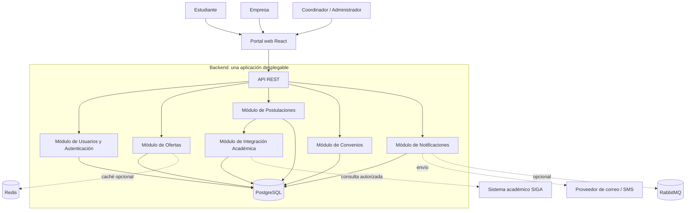

# Estilo arquitectónico

## 1. Propósito

Definir la organización global propuesta para el **Sistema Web para la Gestión y Publicación de Prácticas Preprofesionales de la UNSCH**, tomando como base los requisitos, atributos de calidad y drivers documentados en `analisis-de-sistema/`.

## 2. Estilo seleccionado

**Monolito modular con API REST y enfoque interno de Clean Architecture.**

El backend se implementará como una única aplicación desplegable, organizada en módulos con responsabilidades claras: Autenticación y Usuarios, Ofertas, Postulaciones, Convenios, Notificaciones e Integración Académica. El portal web, propuesto con React, consume la API REST del backend. Los módulos comparten el mismo proceso de ejecución y, en la primera versión, una base de datos PostgreSQL, pero mantienen límites lógicos y evitan acceder directamente a la lógica interna de otros módulos.

Este estilo no significa colocar todo el código en una sola clase o carpeta. La aplicación debe separar dominio, casos de uso, presentación e infraestructura, y mantener dependencias controladas. Esta es una **propuesta arquitectónica** del repositorio, no una afirmación de que todas las tecnologías ya estén implementadas.

## 3. Drivers que motivan la decisión

- **DA01 — Centralización de procesos dispersos:** un portal web y una API consistentes reúnen los trámites de estudiantes, empresas y coordinadores.
- **DA02 — Picos de demanda estacionales:** medir el rendimiento y optimizar consultas antes de incorporar caché o procesamiento asíncrono.
- **DA03 — Integración con sistemas legados:** aislar la comunicación con SIGA mediante un adaptador.
- **DA04 — Evolución modular:** separar capacidades del negocio en módulos dentro de una aplicación desplegable.
- **DA05 — Comunicación estandarizada:** exponer contratos HTTP mediante API REST.
- **DA06 — Mantenibilidad:** controlar dependencias y reducir el impacto de los cambios.

## 4. Módulos y responsabilidades

| Módulo / componente | Responsabilidad |
|---|---|
| Portal web (React) | Presentar los flujos de estudiantes, empresas, coordinadores y administradores. |
| API REST / Presentación | Recibir solicitudes HTTP, validar datos de entrada, aplicar autenticación y autorización, y devolver respuestas. |
| Autenticación y Usuarios | Gestionar identidad, sesión o tokens y roles. |
| Ofertas | Publicar, editar, cerrar, buscar y filtrar ofertas de prácticas. |
| Postulaciones | Registrar postulaciones, impedir duplicados y controlar estados. |
| Convenios | Dar seguimiento al ciclo de vida de los convenios de prácticas. |
| Notificaciones | Preparar y gestionar avisos por cambios de estado y nuevas ofertas. |
| Integración Académica | Consultar elegibilidad a través de un adaptador para SIGA, si existe un mecanismo institucional autorizado. |
| PostgreSQL | Persistir la información estructurada de la aplicación mediante tablas y restricciones adecuadas. |
| Redis (opcional) | Almacenar temporalmente datos de lectura frecuente solo si las mediciones justifican su uso. |
| RabbitMQ (opcional) | Procesar tareas asíncronas, por ejemplo, notificaciones, solo si se requiere y se puede operar. |
| Servicio externo de correo/SMS | Entregar notificaciones mediante un proveedor externo. |

Los módulos de negocio no deben importar ni modificar directamente las clases internas de otros módulos. La comunicación entre módulos se realizará mediante interfaces, servicios de aplicación o contratos internos definidos explícitamente.

## 5. Diagrama global

El diagrama representa límites lógicos dentro de una aplicación desplegable, no servicios independientes. PostgreSQL es la persistencia principal propuesta. Redis y RabbitMQ no son requisitos iniciales: se añadirán únicamente si hay una necesidad demostrada. La integración con SIGA depende de que la universidad habilite un mecanismo de acceso.

## 6. Ventajas esperadas

- Menor complejidad de desarrollo, despliegue y monitoreo que una arquitectura distribuida.
- Módulos con responsabilidades definidas y menor acoplamiento.
- Transacciones más sencillas para operaciones relacionadas, como registrar una postulación y validar su estado.
- Pruebas unitarias y de integración más fáciles de ejecutar en una primera versión.
- Posibilidad de separar un módulo en un servicio independiente en el futuro, si la necesidad se demuestra y sus límites están bien definidos.

## 7. Costes y riesgos

- Los módulos comparten el proceso de despliegue; una publicación del backend puede afectar a toda la aplicación.
- Si no se respetan los límites, el monolito puede volverse difícil de mantener y los módulos pueden quedar acoplados.
- El escalamiento suele hacerse inicialmente para toda la aplicación, no para un módulo aislado.
- Redis, RabbitMQ y otros componentes aumentan el coste operativo y no deben añadirse solo por estar en un diagrama.
- Se deben proteger las operaciones concurrentes y definir transacciones, restricciones y permisos en la base de datos.

## 8. Criterios de validación

1. El backend se construye y despliega como una aplicación, con módulos de negocio identificables.
2. Cada módulo tiene una responsabilidad y una interfaz interna documentadas.
3. Los controladores no contienen reglas centrales del negocio.
4. Las integraciones con SIGA y proveedores de notificaciones están aisladas detrás de adaptadores.
5. Las reglas de autorización se validan en las operaciones protegidas.
6. Las pruebas cubren permisos, elegibilidad académica, duplicidad de postulaciones y transiciones de estado.
7. La necesidad de Redis o RabbitMQ se confirma con escenarios de carga y requisitos operativos.

## 9. Decisión

Se selecciona **monolito modular** como estilo arquitectónico para la primera versión del sistema. La organización interna seguirá el enfoque de **Clean Architecture**, descrito en `arquitectura/enfoque/enfoque-arquitectonico.md`. La posible extracción futura de un módulo a un servicio independiente será una decisión posterior, sustentada en necesidades reales.